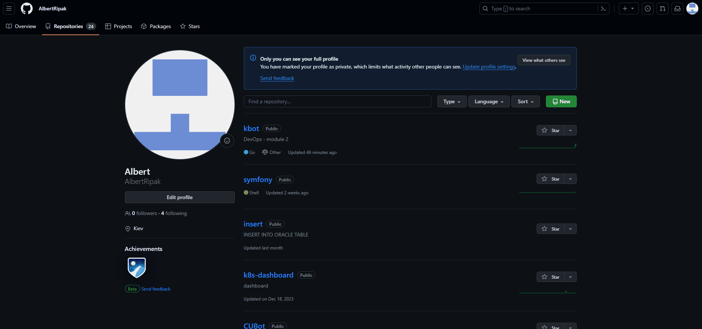

# kbot
<b>DevOps - module 2</b><br>
<b>KBOT - приклад програмування телеграм бота на мові Golang</b><br>
<b>Технічне Завдання на розробку функціонального Telegram-бота з кореневою командою та налаштуваннями.</b><br>
<b>Вимоги:</b><br>
&bull; Мова Golang;<br>
&bull; Фреймворки github.com/spf13/cobra та gopkg.in/telebot.v3;<br>
&bull; Реалізувати обробники повідомлень для бота, які будуть відповідати на повідомлення в Telegram;<br>
&bull; Створити функції-обробники повідомлень бота;<br>
&bull; Додати ці функції до методів об'єкта telebot.Bot;<br>
&bull; Обробляти повідомлення відповідно до їх типу та вмісту.<br>

<b>Таблиця рекомендацій для виконання:</b>
| Рекомендації та приклад виконання                                                                      |
|------------------------------------------------------------------------------------|
| &bull; Встановити Golang та налаштувати середовище розробки.  <a href="https://go.dev/doc/install">Інструкція для OC Windows </a> |
| &bull; <a href="#newProjectGit">Створюємо новий проєкт на GitHub.</a>|
| &bull; <a href="#cobra">Додати залежність на бібліотеку github.com/spf13/cobra за домопогою import.</a>  |
| &bull; Створити Telegram-бота за допомогою <a href="https://telegram.me/BotFather">BotFather.</a>  |
| &bull; <a href="#tele_token">Отримати токен бота та зберегти його у змінну середовища TELE_TOKEN.</a>|
| &bull; <a href="#import_package">Імпортувати необхідні бібліотеки.</a> |
| &bull; <a href="#import_telebot">Встановити бібліотеку gopkg.in/telebot.v3 за допомогою go get.</a> |
| &bull; <a href="#get_token">Отримати токен бота зі змінної середовища. </a>|
| &bull; <a href="#new_object">Створити об'єкт бота за допомогою telebot.NewBot().</a>|
| &bull; <a href="#new_message">Додати обробник повідомлень за допомогою kbot.Handle</a>|
| &bull; <a href="#about_message">Описати функцію-обробник, яка буде відповідати на повідомлення.</a>|
| &bull; <a href="#build_bot">Зібрати, запустити та перевірити бота.</a>|
| &bull; Створити файл <a href="https://github.com/AlbertRipak/kbot">README</a> з описом проєкту, посиланням на бота у форматі https://t.me/albertripak_bot, включаючи інструкції для встановлення та приклади використання команд.</a>|
| &bull; <a href="https://github.com/AlbertRipak/kbot">Завантажити код на GitHub</a>.|
| &bull; <a href="#buildx">Створення мульти-архітектуриний docker image.</a>.|
| &bull; <b><a href="#PLATFORM">Різниця між BUILDPLATFORM та TARGETPLATFORM</a></b>|

 <a id="newProjectGit"></a>

<b><a id="cobra">GITHUB.COM/SPF13/COBRA</a></b>
Генеруємо початковий код
```cmd
go install github.com/spf13/cobra-cli@latest
```
Генеруємо файл main.go, основний файл коду
заповнить файл go.mod початковими модулями 
та додасть файл в директорію cmd/root.go де знаходиться згенерований початковий код
за допомогою команди:
```cmd
cobra-cli init
```
код версіїї буде розміщуватись тут:
```cmd
cobra-cli add version
```
код безпосередньо нашого боту буде розміщуватись тут:
```cmd
cobra-cli add kbot
```

<b><a id="tele_token">Токен телеграм бота</a></b>
Після проходження кроку <a href="#telegram_bot">"Створити Telegram-бота за допомогою BotFather"</a>
BotFather надасть вам токен за допомогою якого можна встановити зв'язок з Телеграм Ботом.
Для того щоб зберегти токен в змінну середовища, потрібно виконати наступні кроки:
```cmd
TELE_TOKEN=[copy and past your token here]
export TELE_TOKEN
```
<b><a id="import_package">Щоб імпортувати необхідні бібліотеки потрібно:</a></b>
у файл cmd/kbot.go в блок import додати наступне
```cmd
import (
	"fmt"
	"log"
	"os"
	"time"

	"github.com/spf13/cobra"
)
```

<b><a id="import_telebot">Щоб встановити бібліотеку telebot.v3 потрібно:</a></b>
у файл cmd/kbot.go в блок import додати рядок telebot "gopkg.in/telebot.v3"
```cmd
import (
	"fmt"
	"log"
	"os"
	"time"

	"github.com/spf13/cobra"
    telebot "gopkg.in/telebot.v3"
)
```

<b><a id="get_token">Щоб отримати токен зі змінної середовища потрібно: </a></b>
у файлі cmd/kbot.go додати в блок var () наступний рядок
```cmd
var (
	//TeleToken bot
	TeleToken = os.Getenv("TELE_TOKEN")
)
```
<a id="new_object">Щоб створити об'єкт бота за допомогою telebot.NewBot().</a>
в файл cmd/kbot.go додати наступне
```cmd
	Run: func(cmd *cobra.Command, args []string) {
		fmt.Printf("kbot %s started", appVersion)
		kbot, err := telebot.NewBot(telebot.Settings{
			URL:    "",
			Token:  TeleToken,
			Poller: &telebot.LongPoller{Timeout: 10 * time.Second},
		})
    }
```
<b><a id="new_message">Додати обробник повідомлень за допомогою kbot.Handle</a></b>
<b><a id="about_message">Описати функцію-обробник, яка буде відповідати на повідомлення міститься у блоці switch payload{}</a></b>
```cmd
kbot.Handle(telebot.OnText, func(m telebot.Context) error {
			log.Print(m.Message().Payload, m.Text())
			payload := m.Message().Payload

			switch payload {
			case "hello":
				err = m.Send(fmt.Sprintf("Hello I'm Kbot %s", appVersion))
			default:
				err = m.Send(fmt.Sprintf("Ой, чоловіче, що ж тиж хочеш?" + "\nТицьни сюди і дізнаєшся що я вмію /help" + "\nабо сюди і дізнайся що я вмію тяльки це /helpNext"))
			}
			return err
		})
```
<a id="build_bot">Щоб зібрати, запустити та перевірити бота.</a>
```bash
git clone https://github.com/AlbertRipak/kbot.git
TELE_TOKEN=[copy and past your token here]
export TELE_TOKEN
go build -ldflags "-X 'github.com/AlbertRipak/kbot/cmd.appVersion=1.0.5'"
./kbot start
```

<a id="buildx">Docker: How to Build and Push multi-arch Docker Images to Docker Hub</a>
Підготуємо Dockerfile
І так, тут усе доволі цікаво! Я використовую в Dockerfile в конструкції FROM golang, golang є кросплатформовим imege'ом. В даному випадку ми будемо використовувати прапорець --platform.
--platform - можна використовувати для визначення платформи зображення у тому випадко коли FROM посилається на багатоплатформне зображення. Наприклад linux/amd64,linux/arm64,windows/amd64...
За замовчуванням використовується цільова платформа запиту на збірку. Глобальні агрументи збірки можна використовувати в занченні цього прапорця, наприклад, автоматичні ARG платформи дозволяють примусово перевести етап на власну платформу збірки (--platform=$BUILDPLATFORM) і використовувати його для крос-компіляції на цільову платформу всередині етап.
$BUILDERPLATFORM - це змінна, яка визначається платформою, на якій вибдудовується Docker-образ.
ARG TARGETPLATFORM - визначає аргумент TARGETPLATFORM, який буде використовуватися для тестування на різних платформах. 
TARGETPLATFORM - використовується для вибору архітектури для компіляції нашого коду.
```shell
docker run --rm -e TARGETPLATFORM=linux/amd64 test-app
```
коли виконується вище наведена команда, значення змінної TARGETPLATFORM передається в Dockerfile після чого образ контейнера буде вибраний відповідно нашій змінній.

Створюємо нову інстанцію Docker buildx з iм'ям mybuilder, завантажуємо та робимо поточною.
```bash
docker buildx create --name kbotbuilder --platform linux/amd64,linux/arm64 --bootstrap --use
```
# на рахунок цієї платформи - windows/amd64 (потрібно почитати документацію)
docker buildx create - створює нову інстанцію buildx
--name mybilder - задає ім'я для нового будівельника
--botstrap - завантажує будівелник
--use - робить mybuider поточною інстанцією будівельника
Наступною командою переглядаємо доступні інстанції docker buildx
```bash
docker buildx ls
```
запускає buildx image
```shell
docker buildx build --platform linux/amd64,linux/arm64 -t aripak/kbot:latest --push .
```

P.S.
1. Для ємоджі використувувався сайт <a href="https://emojipedia.org/">emojipedia.org</a>!
2. gofmt - це інструмент форматування коду Golang. Він використовує табуляцію для відступу та пробіли для вирівнювання. Вирівнювання передбачає, що редактор використовує шрифт фіксованої ширини.
Прапори:
-s - цей прапор вказує gofmt форматувати код лише в режимі "стиснення". Це означає, що код буде форматований без змін в його логіці.
-w - цей прапор вказує gofmt записувати зміни форматування назад до вихідних файлів.
3. golint - згідно з інформаціює пошуковика гугл є застарілим, на його заміну прийшов go ven - перевіряє вихідний код Go та повідомляє про підозрілі конструкції як-от виклики Printf, аргументи яких не відповідають рядку формату.Vet використовує евристику, яка не гарантує, що всі звіти є справжніми проблемами, але вона може знаходити помилки, які не вловлюються компіляторами.

```go
gofmt -s -w ./
```
4. <b><a id="PLATFORM">Різниця між BUILDPLATFORM та TARGETPLATFORM</a></b>
<br>BUILDPLATFORM та TARGETPLATFORM – це змінні, що використовуються в Dockerfile для динамічної побудови образів. Їх часто плутають, тому важливо розуміти різницю між ними:
<br>BUILDPLATFORM:

Визначає платформу, на якій будується Docker-образ.
Зазвичай використовується з buildx для динамічної побудови образів для різних платформ.
Значення BUILDPLATFORM передається команді docker build за допомогою аргументу --build-arg:
docker build --build-arg BUILDPLATFORM=linux/amd64 .
<br>TARGETPLATFORM:

Визначає платформу, для якої будується код у вашому Docker-образі.
Зазвичай використовується в інструкціях RUN для налаштування середовища компіляції та запуску.
Значення TARGETPLATFORM може бути встановлено в Dockerfile або передано команді docker run за допомогою аргументу -e:
docker build -t my-app .
docker run --rm -e TARGETPLATFORM=linux/amd64 my-app
Приклад:

Припустимо, ви хочете побудувати Docker-образ Go, який буде працювати на платформах linux/amd64 та arm64.
Ви можете використовувати наступний Dockerfile:
Dockerfile
FROM --platform=$BUILDPLATFORM golang:1.22 as builder

WORKDIR /app

COPY . .

RUN go build -o main -target $TARGETPLATFORM

FROM scratch as runner

COPY --from=builder /app/main /app/main

CMD ["/app/main"]
Використовуйте цей код обачно.
У цьому прикладі:
BUILDPLATFORM використовується для динамічної побудови образу Go для платформи, на якій вибудовується ваш проект.
TARGETPLATFORM використовується для налаштування команди go build для компіляції коду Go для платформи linux/amd64 або arm64.
Підсумок:

BUILDPLATFORM визначає платформу, на якій будується Docker-образ.
TARGETPLATFORM визначає платформу, для якої будується код у вашому Docker-образі.


<a href="https://pkg.go.dev/cmd/gofmt">Документація по gofmt!</a>

<a href="https://go.dev/"></a>